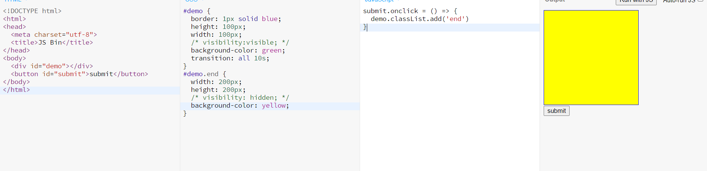

## 用 left 制作从左到右的动画

- 用 left 做位移的动画
  
  - 注意使用 clearInterval
- 不同在渲染，浪费性能
  
- 用 transform 做位动画，性能节省
  

#### 原理

- 每过一段时间（用 setInterval)
- 将 div 移动一小段距离，直到移动到目标地点

#### 注意性能

- 绿色表示重新绘制
- CSS 渲染过程一次包含了布局、绘制、合成
- 其中布局和绘制有可能被省略

#### 打开 rendering 查看渲染过程

- 
- 
- 

## 用 transform 做位动画

## 浏览器的渲染原理

#### 参考文章

- [渲染树构建、布局及绘制]()
- [渲染性能]()
- 使用 transform 来实现动画

```
代码空缺
```


#### 查看 CSS 各属性触发什么

- [CSSTriggers](https://csstriggers.com)
  - 
  - 
  - 一般只看前面的那个 Chrome，Blink 是一个由 Google 主 dao 开发的開源瀏覽器排版引擎

## 浏览器渲染过程

#### 步骤

- 将 HTML 构建成 HTML 书（DOM）
- 将 CSS 构建成 CSS 树（CSSDOM）
- 将两棵树合并成一棵渲染树（render tree)
- Layout 布局（文档流、盒模型、计算大小和位置）
- Paint 绘制（把边框颜色、文字颜色、阴影等画出来）
- Compose 合成（根据层叠关系展示画面）


## 如何更新样式

#### 用 JS 更新样式

- `div.style.background = 'red'`
- `div.style.display = 'none'`
- `div.classList.add('red')`
- `div.remove()`直接删除节点

#### 三种不同的渲染方式


- 第一种，全走
  - `div.remove()`会出发当前小时，其他元素 relayout
- 第二种，跳过 layout
  - 改变背景颜色，直接 repaint + composite
- 第三章，跳过 layout 和 paint
  - 改变 transform，只需要 composite
  - 注意必须全屏查看效果，在 iframe 中有问题

## CSS 动画优化

- [Google 写的文章](https://developers.google.com/web/fundamentals/performance/rendering/optimize-javascript-execution)
  - 注意观看 tldr
  - 
- JS 优化
  - 使用`requestAnimationFrame`代替`setTimeout`或`setInterval`
- CSS 优化
  - 使用`will-change`或`translate`

## transform

- 位移 translate
- 缩放 scale
- 旋转 rotate
- 倾斜 skew

#### 经验

- 一般都需要配合 transition 过渡
- inline 元素都不支持 tranmsform，需要先变成 block
- 在控制台如何选择 hover
  - 
- 如何在控制台快速改变 tranlate 的值
  - 
- transform:translateZ 的视点
  - 

### transform 之 translate


- `translateX(<length-percentage>)`就是指可以用长度或百分数
- `translateY`
- `translate(X轴，Y轴)`
- `translateZ(<length>)` 且父容器是`perspective`
- `translate3d(x, y ,z)`
- translate(-50%, -50%)可以坐绝对定位元素的居中
  - 
  - [绝对定位居中在线观看](http://js.jirengu.com/jojimowuma/6/watch?html,css,output)

### transform 之 scale

- `scaleX(<number>)`
- `scaleY(<number>)`
- `scale(<number>,<number>)`
- [在线观看](http://js.jirengu.com/jojimowuma/7/watch?html,css,output)

### transform 之 rotate

- `rotate()`
- `rotateZ()`
- `rotateX()`
- `rotateY()`

### transform 之 skew

- 用的较少
- 演示

### transform 多重效果（组合）

- `transform:scale(0.5) translate(-100%, -100%)`
- `transform:none`取消所有
- [跳动的心]()

## transition 过渡

#### 语法

#### 注意

- 并不是所有的属性都能过渡
- diplay:none => block 没法过渡
  
- 一般改成 visibility:hidden => visible
  

- opacity 过渡
  
- 背景色可以变，因为实际上是数值
  

#### 经验
