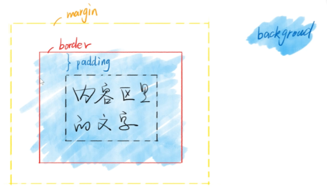
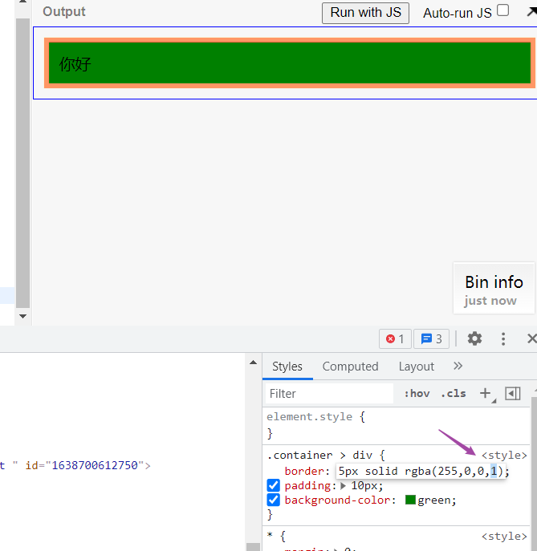
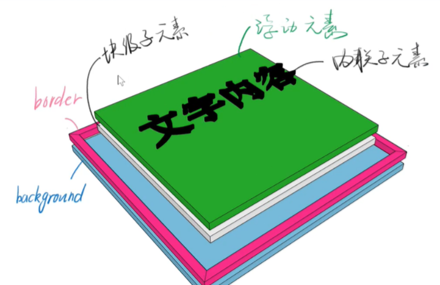
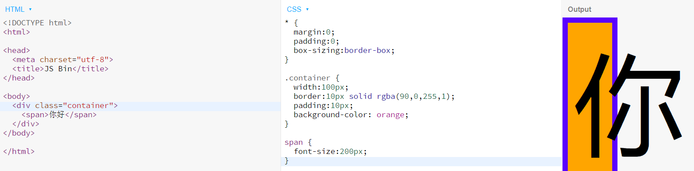
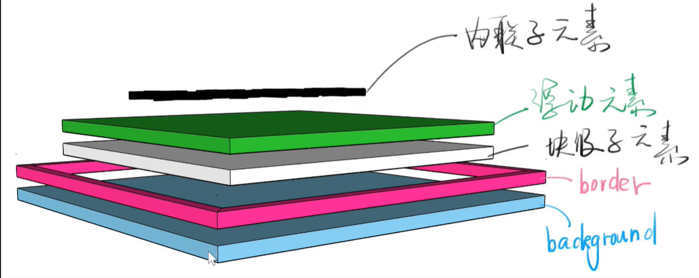

# CSS 定位

## 盒模型是平面上的

布局是屏幕平面上的，而定位是垂直于屏幕的

## 两个问题

### 背景的范围是从哪里到哪里？

- 是从 border 外边延围城的区域
- 背景颜色时包括 border 的，不过被 border 的设置给覆盖掉了，也就是外边缘围成的区域
- 先选中 border 的颜色，然后按下 alt，往下的方向键数字减少，往上的方向键数字增加,就能

### 从左边看一个 idv，是什么样子？

- 从垂直的角度来看
  
- 文字在 border 和背景颜色上面（需要将父容器的宽度设定死，然后加大文字的 font-size）
  
- 一个 div 的分层
  
