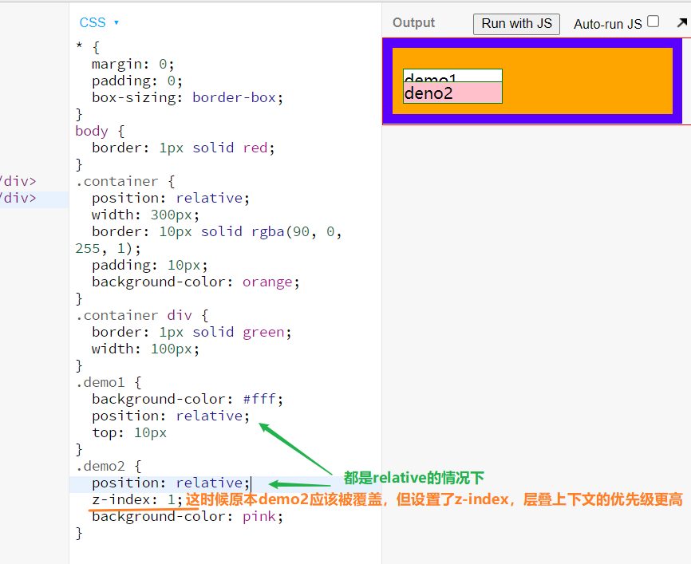
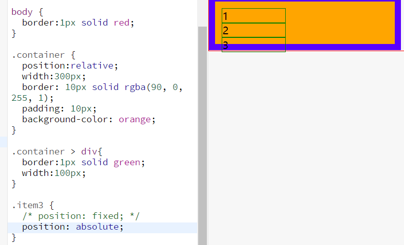
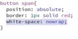
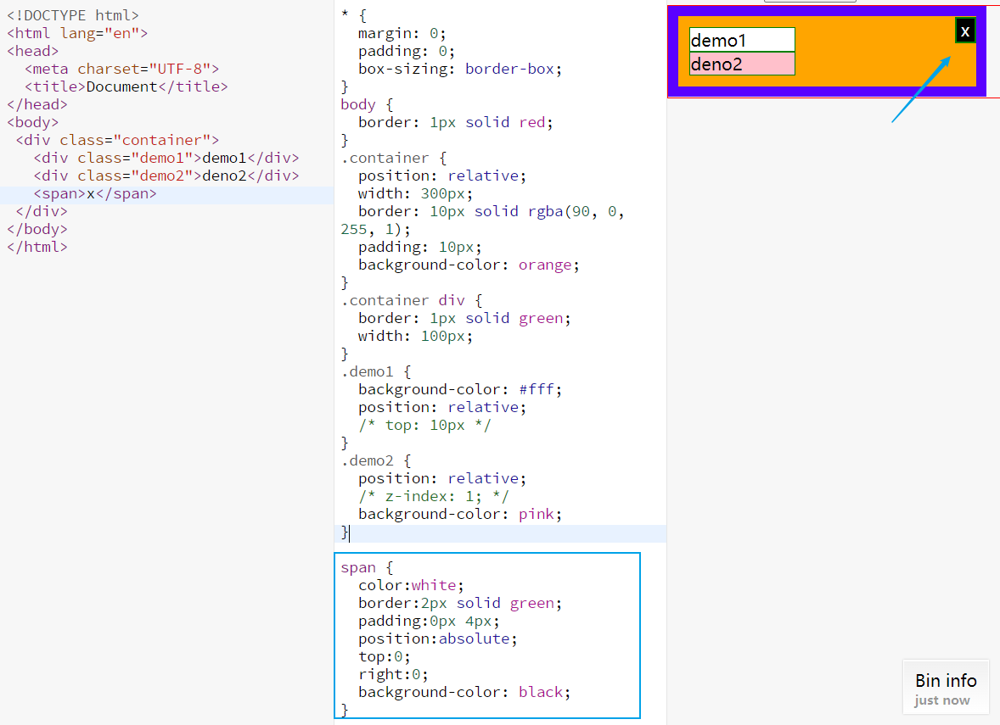
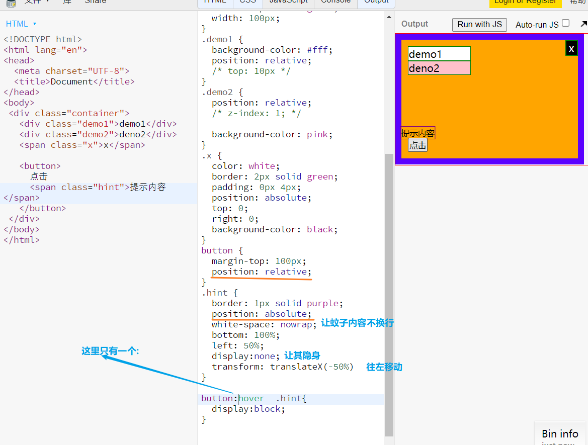
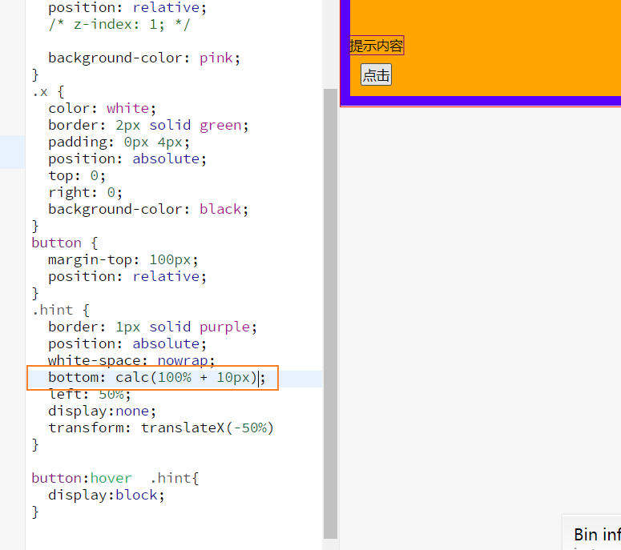
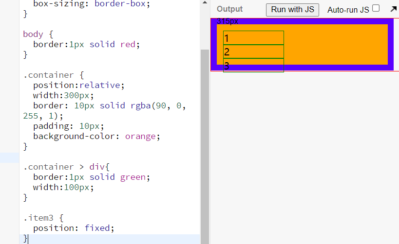

# CSS 定位

## 盒模型是平面上的

布局是屏幕平面上的，而定位是垂直于屏幕的

- 

## 两个问题

### 背景的范围是从哪里到哪里？

- 是从 border 外边延围城的区域
- 背景颜色时包括 border 的，不过被 border 的设置给覆盖掉了，也就是外边缘围成的区域
- 先选中 border 的颜色，然后按下 alt，往下的方向键数字减少，往上的方向键数字增加,就能

### 从左边看一个 idv，是什么样子？

- 从垂直的角度来看
  - 
- 文字在 border 和背景颜色上面（需要将父容器的宽度设定死，然后加大文字的 font-size）
  - 
- 一个 div 的分层
  - 

## 定位元素

#### 定位元素总览

- static 默认值，待在文档流里
- relative 相对定位，升起来，但不脱离文档流
- absolute 绝对定位，脱离文档流，定位基准是祖先里的非 static 定位
- fixed 固定定位，定位基准是 viewport
  - 但其内部的如果有 transform 这种内容，就不固定了
- sticky 粘滞定位

#### 经验

- 如果写了 absolute，一般都需要补一个 relative
- 如果写了 absolute 或者 fixed，一定要补上 top 和 left
- sticky 兼容性很差，尽量不用

#### static 静态定位

- 默认的，也就是无须设置
- 常规文档流
- 块级元素自上而下堆叠

#### relative 相对定位

- 相对于原来文档流中的位置
- 使用 top/left/right/bottom
- 可以设定负值，代表相反的方向
- 还是处于原来的文档流当中，根据相对定位移动后，页面没有变化，说明这个元素还是占据原来的空间，其他元素没有因此而产生变化
- 使用关键，需要考虑元素原来的空间，防止被挡住，可以加上 margin 或者 padding
  - 
- 使用负值
  - 

##### 使用场景

- 用于做位移
- 用于给 absolute 元素做爸爸

##### 配合 z-index

- z-index:auto 为默认值，不会创建层叠上下文
- z-index:0/1/2 当其值为正数时，创造层叠上下文
- z-index:-1 当其值为负数时，创造层叠上下文
- 避免写滥用 z-index，例如写 z-index:9999
  - 
- 如果是不同的层叠小世界，那么后来的叠层世界，高于前者

#### absolute 绝对定位

- 彻底从文档流中拿出来，完全脱离了常规文档流，元素原来占据的空间被回收
- 绝对定位元素默认的定位上下文是 body 元素，而定位基准是祖先最近的那个非 static 定位
- 页面滚动时，为了维护与 body 元素的相对位置，所以会相对滚动
- 一般是给父元素加上 relative，那么就是按照父元素位移了
- 技巧
  - 想要放右边，就 left:100%;想要在上边，就 bottom:100%，其他两个方向同理
  - 善用 left:100%;
  - 善用 Left:50%; 加负 marign
  - 如何让蚊子内容不换行

##### 使用场景

1. 关闭按钮

- 

2. 鼠标提示

- 

3. 位移到 100%+10px 怎么写

- 注意使用`bottom:calc(100% + 10px)`
- 

#### fixed 固定定位

- 
- 脱离文档流
- 定位上下文是视口（手机屏幕或者浏览器串口）

##### 使用场景

1. 凡人的广告

2. 回到顶部按钮
