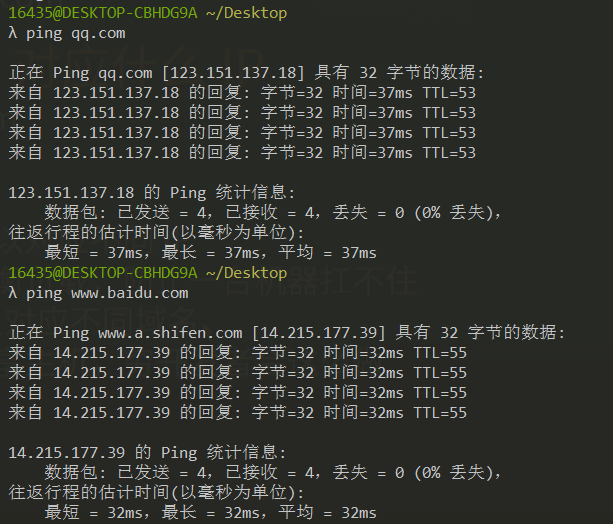
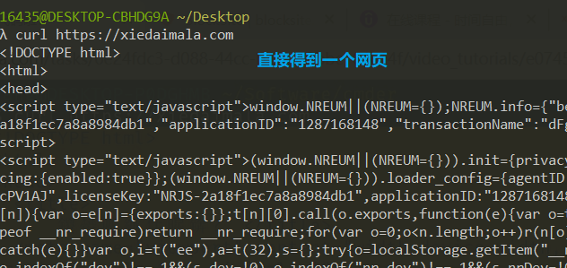

## 域名是什么

#### 域名就是对 IP 的别称

1. 如何得到某个网站对应的域名
   
   `ping 网址`
2. 知识点
   - 一个域名可以对应不同的 IP,这叫做负载均衡，放置一台机器扛不住
   - 一个 IP 可以对应不同域名，这个叫做共享主机，穷开发者会这么做

#### 域名和 IP 是怎么对应起来的

1. DNS 的定义
   - Domain Name System，DNS）是互联网的一项服务。 它作为将域名和 IP 地址相互映射的一个分布式数据库，能够使人更方便地访问互联网。 DNS 使用 TCP 和 UDP 端口 53。
2. 当输入www.baidu.com
   - 浏览器向电信/联通提供的 DNS 服务器询问www.baidu.com对应的什么IP
   - 电信/联通会回答一个 IP
   - 然后浏览器会向对应 IP 的 80/443 端口发送请求
   - 请求内容是查看www.baidu.com的首页
3. 为什么是 80 或 443 端口
   - 服务器默认用 80 提供 http 服务
   - 服务器默认用 443 提供 https 无法
4. `www.baidu.com`和`baidu.com`不是同一个域名
   - com 是顶级域名
   - `baidu.com`是二级域名（俗称一级域名）
   - `www.baidu.com`是三级域名（俗称二级域名）
   - `baidu.com`和`www.baidu.com`是父子关系
   - www 是多余的，一般不用

## 路径

#### 如何请求不同的页面

1. 路径可以做到
   - `https://developer.mozilla.org/zh-CN/docs/Web/HTML`
   - `https://developer.mozilla.org/zh-CN/docs/Web/CSS`
2. 工具
   - 使用 Chrome 开发者工具 Network 面板观看
3. 查询参数
   - 同一个页面，查看不同的内容
   - `www.baidu.com/s?wd=hi`
   - `www.baidu.com/s?wd=hello`
4. 锚点
   - 同一个内容，不同的位置
   - `https://developer.mozilla.org/zh-CN/docs/Web/CSS#参考书`
   - `https://developer.mozilla.org/zh-CN/docs/Web/CSS#教程`
   - 锚点看起来有中文，实际上不支持中文，会转化为别的字符
   - 锚点是无法在 Network 面板上看到的
   - 锚点不会传给服务器

## HTTP（协议）

#### 定义

HyperText Transfer Protocol
超文本传输协议（英语：HyperText Transfer Protocol，缩写：HTTP）是一种用于分布式、协作式和超媒体信息系统的应用层协议。HTTP 是万维网的数据通信的基础。

#### curl 发送 HTTP 请求

1. `curl -v http://baidu.com`
2. `curl -s -v -- https://www.baidu.com`
3. 过程
   - url 会被 curl 工具重写，先请求 DNS 获取 IP
   - 进行 TCP 连接，TCP 连接成功后，开始发送 HTTP 请求
   -
